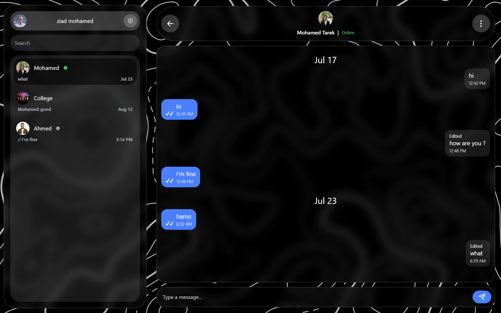
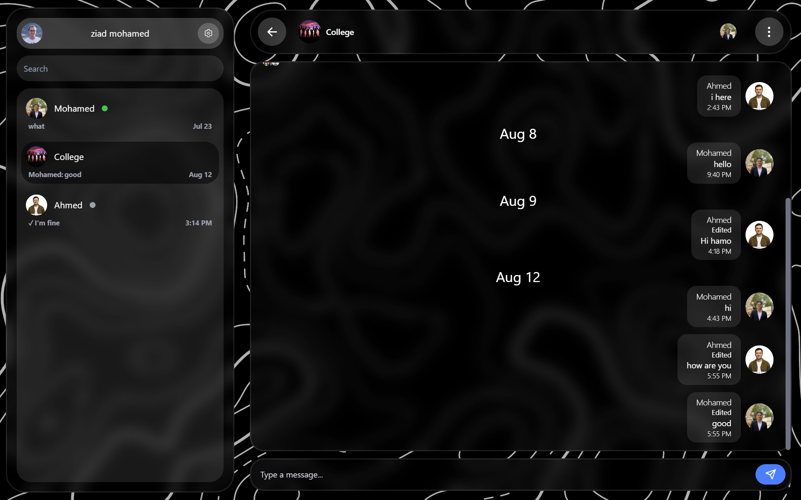
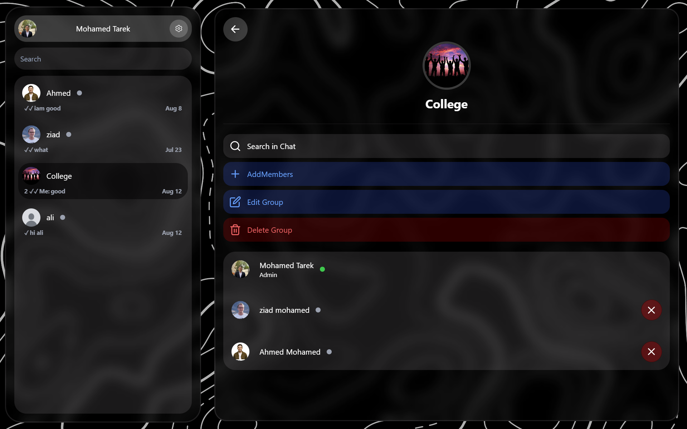
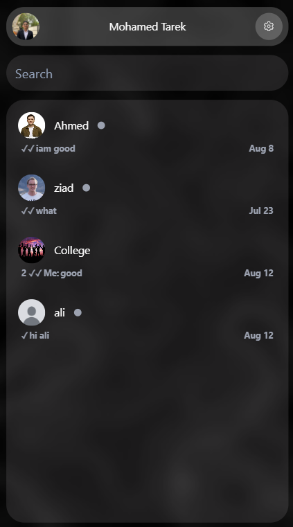

# Real-Time Chat Application

A full-stack real-time chat application built with **React.js, Node.js, Express.js, MongoDB, and Socket.IO**.

The application provides private and group conversations with real-time communication and chat management features.

## Features

- User registration and authentication
- Private one-to-one conversations
- Group conversations
- Real-time messaging using Socket.IO
- Online and offline user status
- Typing indicators
- Read and unread messages
- Message seen status
- Chat notifications
- User search
- Group member management
- Add and remove group members
- Group settings
- Leave groups
- Profile avatar upload
- Image and file uploads
- Responsive user interface
- Automatic message scrolling
- Real-time chat updates

## Tech Stack

### Frontend

- React.js
- JavaScript
- Redux Toolkit
- React Router
- Tailwind CSS
- Axios
- Vite

### Backend

- Node.js
- Express.js
- Socket.IO
- REST APIs
- Multer

### Database

- MongoDB
- Mongoose

### Tools

- Git
- GitHub
- npm

## Project Structure

The project is divided into two main parts:

```text
Chat
├── front
│   └── React.js Frontend
│
└── back
    └── Node.js / Express.js Backend
```

## Real-Time Features

Socket.IO is used to handle real-time communication between users.

The application supports real-time events such as:

- Sending and receiving messages
- Online and offline status
- Typing indicators
- Read message updates
- Chat updates
- Group-related events

## Chat Features

Users can communicate through private conversations or group chats.

Private chats support real-time messaging, message status, typing indicators, and online presence.

Groups allow users to manage members, update group information, add or remove members, and leave groups.

### Chat



### Group Chat



### Group Settings



### Mobile View



## Demo Account

A demo account will be provided for testing the application.

```text
Email: demo@gmail.com
Password: demo
```

For testing real-time communication, multiple demo accounts can be used simultaneously.

## Purpose

This project was built as a practical full-stack project to improve my experience with frontend development, backend APIs, database management, authentication, and real-time communication.

## Author

### Mohamed Tarek

Computer Science Student at Sadat University

Full-Stack Developer

GitHub: M0hammed180

LinkedIn: [My LinkedIn Profile](https://www.linkedin.com/in/mohammed-tarek-279206367/)
